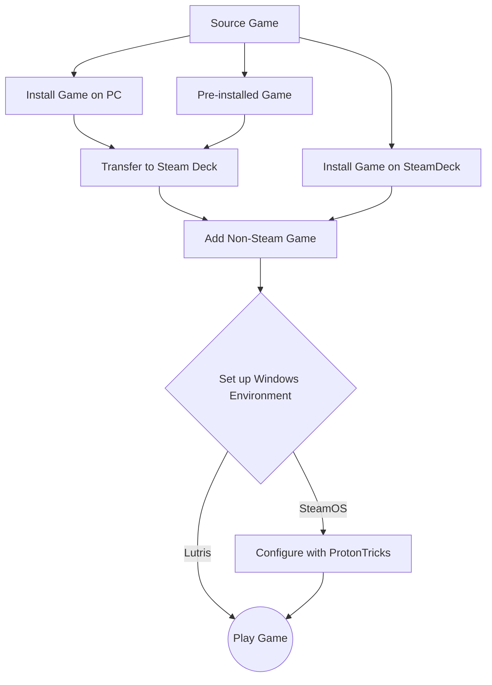

# 
🏴‍☠️ Steam Deck Pirates' Cove 🏴‍☠️

## Info About Steam Deck

### Game Mode
Game Mode is essentially an overlay running Big Picture Mode, allowing you to access the Quick Access Menu and the Steam Menu and control everything in one easy to use interface. This is the preferred method to play games as it allows you to set hardware limits, change settings on the fly, enable a fps counter, and many other things on the fly. This is what the Deck boots into by default.

### Desktop Mode
Desktop Mode is what Game Mode is installed over. It is the real computer behind everything. Built on Arch Linux with KDE Desktop Environment. It can be accessed through Game Mode by opening the Steam Menu and clicking **Power > Switch to Desktop**.

### Wine
Wine (originally an acronym for "Wine Is Not an Emulator") is a compatibility layer capable of running Windows applications on several POSIX-compliant operating systems, such as Linux, macOS, & BSD. Instead of simulating internal Windows logic like a virtual machine or emulator, Wine translates Windows API calls into POSIX calls on-the-fly, eliminating the performance and memory penalties of other methods and allowing you to cleanly integrate Windows applications into your desktop.

*from [WineHQ](https://www.winehq.org/)*

> To simplify: Wine Makes Linux run Windows apps

### Proton
Proton is a compatibility layer for Windows games to run on Linux-based operating systems. Proton is developed by Valve in cooperation with developers from CodeWeavers. It is a collection of software and libraries combined with a patched version of Wine to improve performance and compatibility with Windows games. Proton is designed for integration into the Steam client as "Steam Play". It is officially distributed through the client, although third-party forks can be manually installed. Proton incorporates several libraries that improve 3D performance. These include Direct3D-to-Vulkan translation layers, namely DXVK for Direct3D 9, 10 and 11, and VKD3D-Proton for Direct3D 12.

*from [Wikipedia](https://www.wikipedia.org)*

***There are two different Proton iterations right now:***

#### Steam's Official Proton
This is what comes baked into the system more or less. These are selectable by going into the game Properties and clicking the Compatibility tab. From there you'll click the checkbox next to "Force the use of a specific Steam Play compatibility tool". Here you will be able to select any Proton available through steam as well as any others you have installed. Sometimes different games work with different Proton versions. More often than not Proton Experimental is the most up to date and has the best compatibility rate. All games are different, some may not have working sound unless you go to an old version. Mess with this first if you have issues running games.

#### GE-Proton
GE Proton (or Glorious Eggroll Proton) is an open source variant of Steams Proton that is user developed and maintained. It usually has faster support for games and also includes additional features and fixes, some which Steam can't include for licensing reasons. It's usually installed through ProtonUpQt, and can be selected the same as any other Proton version once installed, in the compatibility section of any game's properties.

### Prefixes
A (Wine/Proton) prefix is what makes Proton able to run a Windows app on Linux "natively". Inside of any prefix you'll usually find a series of folders and files, one being `drive_c`. The reason for all of this is the folder structure and other dependencies and files emulates a Windows environment. Essentially a prefix pretends to be a Windows hard drive, pretends Windows is installed on it, and translates Linux commands/operations into Windows specific versions. This combined with Wine/Proton are the most major components of playing a Windows game on a Linux device.

### Launchers
Launchers are apps built for Linux that allow you to play games from other Launcher based game companies. Heroic, Bottles, and Lutris are the mainly discussed ones. These add a few more things some games may need to run efficiently or properly at all. While these are a preferred method for ease of use, keep in mind this is another layer between your game and SteamOS so at times troubleshooting it may be a little more difficult. These also usually come with Wine configuration, login support for launchers, the option to add shortcuts to Steam, and a whole slew of other features allowing you to do less tinkering and kind of just get going.

### Decky Plugins

## Apps you NEED TO have installed

> [!NOTE]
> Items in *Italics* are available on the Discover Store.

| Name/Link | Description |
| :--- | :---: |
| *[ProtonUpQt](https://davidotek.github.io/protonup-qt/)* | This allows you to install unofficial Proton versions for Steam, Lutris, and other specialty situations. Highly recommended whether you're sailing the seas or not. |
| *[Flatseal](https://github.com/tchx84/Flatseal)* | Use this app to give extra permission to Flatpak apps. Flatpak is the method of installation used when you download apps in Discover. Most often in this scenario you would use this to allow an app to see all of the filesystem (if your other drives or folders aren't showing in an app like Lutris, this is how you would make it available). |
| *[ProtonTricks](https://github.com/Matoking/protontricks)* | Similar to WineTricks, this allows you to manipulate the prefixes for your individual Windows based games. You can install dependencies, set the prefix up to use DLL files (for mods), set the Windows versions compatibility, install game updates or other exe files, and so much more. This is like the control panel in Windows for each individual games prefix. This is also where you can find the **compatdata** folder number for any non steam games you have installed (if you installed through steam). The folder number will be in parentheses next to whatever the entry is titled in steam. |
| *[Bottles](https://usebottles.com)/[Lutris](https://lutris.net)/[Heroic Launcher](https://heroicgameslauncher.com)* | These are the launchers that are mentioned in the previous section. Bottles, Lutris, and Heroic have varied access to the stupid launchers all AAA publishers insist on using. Thing of these as mega launcher that allows you to organize and work with a multitude of launcher-based games without having to jump from launcher to launcher. These can all be found on the discover store. |
| [EmuDeck](https://www.emudeck.com)/[RetroDeck](https://retrodeck.net) | If it isn't obvious from the name, these are the most commonly recommended methods of playing emulators and retro games. The advantages of these methods rather than setting up every emulator individually are: better folder structure, custom settings tailored to the Deck itself, a frontend that brings everything into view easily, and a bunch of other included tools that make getting on the road to emulation a lot easier. There is a larger section about emulation below. |
| *[Warpinator](https://warpinator.com/warpinator-download/)* | Warpinator is a recommended file transfer service for your local network. This application works with all OS options. It will need to be running on both your Steam Deck and the device you are transferring files from/to. For Windows there are two options, [Winpinator](https://winpinator.swisz.cz/) and [Warpinator](https://warpinator.com/warpinator-download/). I have personally had more luck with the actual Warpinator. Sometimes if there are connection issues it is best to manually set the network device in settings. This is the fastest and easiest to set up method for transferring files. |
| *[JDownloader](https://jdownloader.org)* | A download manager that I myself swear by. It can handle multi part links, fill captchas for you, store account info for sites you have a login with, and it usually finds the highest speed it can. Any type of DL link works here for the most part. It is recommend downloading one or two files at a time through settings so you can maximize speed. |
| *[qBittorrent](https://www.qbittorrent.org)* | For downloading torrents. |
| *[AnyDesk](https://anydesk.com/en)/[RustDesk](https://rustdesk.com)* | These are Remote Desktop applications. Use this to access your desktop mode from another PC or Device that can install these apps. This is great in the absence of a keyboard and mouse, you can also send files to yourself (albeit small ones). This is really useful also if you don't wanna keep switching between monitor inputs while docked, etc. If you want real ease of use be sure to set up unattended access with a password for the remote app so you don't have to use the Deck to accept every session. |
| *[PeaZip](https://peazip.github.io)* | Application for handling compressed files. This includes .rar, .7z, .zip, etc. This is especially useful for multipart zip files (repacks/large games) as Dolphin seems to have issues with them. Open PeaZip, click Open, find where your multipart compressed files are, and select one. It should open all of the data inside the window, then click extract and make sure you extract to a place you can find easily! |

> [!CAUTION]
> Do not use BitTorrent or uTorrent as they have been known to be shady in the past.

---

## Guides for installing games

#### Installing games through Steam

> [!NOTE]
> There are a few different ways to get cracked games on your system. They all for the most part end in the same results. Some games require one method over another. Part of piracy is experimenting and finding what works best. If you find a better method for a specific game let us know in the subreddit!

If your game is already in a preinstalled state, skip to **Part 3**.

#### Part 1: Running the setup.exe

<table>
<tr>
<td bgcolor="#E3F2FD" width="100%" style="padding:15px; border-radius:5px;">
<strong>Method 1: Using Wine</strong>
<ul>
    <li>Right-click setup.exe and select Wine.</li>
    <li>Limit the installer to 2GB of RAM.</li>
    <li>Install to your preferred location for games.</li>
</ul>
</td>
</tr>
</table>

<table>
<tr>
<td bgcolor="#E3F2FD" width="100%" style="padding:15px; border-radius:5px;">
<strong>Method 2: Using Steam Compatibility Tool</strong>
<ul>
    <li>Switch your Steam Deck to desktop mode (in the Power settings menu).</li>
    <li>Locate the downloaded game and the setup.exe file.</li>
    <li>Right-click on setup.exe and click “Add to Steam”.</li>
    <li>Open Steam, go to your Library, and click on setup.exe.</li>
    <li>Go to the Compatibility section and check the box for “Force the use of a specific compatibility tool.”</li>
    <li>Select Proton Experimental.</li>
    <li>Create a new folder called Games in <code>/home/deck/</code>.</li>
    <li>Go back to Steam, click on setup.exe, and press Play.</li>
</ul>
</td>
</tr>
</table>

<table>
<tr>
<td bgcolor="#E3F2FD" width="100%" style="padding:15px; border-radius:5px;">
<strong>Continued from either method:</strong>
<ul>
    <li>Wait for the installation to complete.</li>
    <li>Once done, check off all the radio boxes in the installer and close it.</li>
</ul>
</td>
</tr>
</table>

**Note:** FG repacks default to the D drive, and DoDi repacks default to the C drive.

#### Part 2: Installation

> [!WARNING]
> Be patient. Sometimes, it can take a while for the installer to appear.

<table>
<tr>
<td bgcolor="#E3F2FD" width="100%" style="padding:15px; border-radius:5px;">
<ul>
    <li>Once it does, select your preferred language (e.g., English) and click Next.</li>
    <li>Follow the installer steps. Make sure to:
        <ul>
            <li>Set the installation path to the <code>Games</code> folder in the Z drive (or your microSD card if installing there).</li>
            <li>Untick any options for additional installations (like DirectX and Visual C++).</li>
        </ul>
    </li>
    <li>Start the installation.
        <ul>
            <li>Optional step: Limit the installer to 2GB of RAM for installation stability.</li>
        </ul>
    </li>
</ul>
</td>
</tr>
</table>

> [!NOTE]
> Don’t worry if the installation is slow, especially for repacks. This is normal and can take hours depending on game size and compression.

#### Part 3: Running the Game
<table>
<tr>
<td bgcolor="#E3F2FD" width="100%" style="padding:15px; border-radius:5px;">
<strong>Method 1: Using Wine</strong>
<ul>
    <li>Once the installation is complete, go to the installation folder and locate the game’s .exe file (e.g., <code>game.exe</code>).</li>
    <li>Right-click on the <code>game.exe</code>, select “Add to Steam” to add it as a non-Steam game.</li>
    <li>Open Steam, find <code>game.exe</code>, and go to the Compatibility section.</li>
    <li>Set the compatibility to Proton Experimental.</li>
    <li>Launch the game by pressing Play.</li>
    <li>If it shows an error or doesn’t run: Refer to the dependencies guide for help ([Dependencies Guide](#installing-dependencies)).</li>
    <li>Run the game in Desktop mode to verify it works correctly.</li>
    <li>Once verified, you can rename it in Steam to whatever you prefer, and then switch back to Gaming mode to play.</li>
</ul>
</td>
</tr>
</table>
<table>
<tr>
<td bgcolor="#E3F2FD" width="100%" style="padding:15px; border-radius:5px;">
<strong>Method 2: Using Steam Compatibility Tool</strong>
<ul>
    <li>Once the installation is complete, go back to Steam and remove <code>setup.exe</code> (right-click > Manage > Remove non-Steam game).</li>
    <li>Go to the installation folder, find the <code>game.exe</code> file, right-click on it, and add it to Steam.</li>
    <li>Open Steam, find <code>game.exe</code>, and go to the Compatibility section. Repeat steps 5-7 from Part 1 (set the compatibility to Proton Experimental).</li>
    <li>Launch the game by pressing Play.</li>
    <li>Run the game in Desktop mode to make sure it works correctly.</li>
    <li>Exit the game. You can rename it in Steam to whatever you prefer (otherwise, it’ll show as <code>game.exe</code> in gaming mode).</li>
    <li>Switch back to Gaming mode and enjoy your game!</li>
</ul>
</td>
</tr>
</table>

> [!NOTE]
> If it shows an error or doesn’t run: Either the Proton version is incorrect (try different ones) or there’s a missing dependency. If it's the latter, refer to a dependencies guide ([Dependencies Guide](#installing-dependencies)).

<table>
<tr>
<td bgcolor="#E3F2FD" width="100%" style="padding:15px; border-radius:5px;">
<strong>Additional Notes</strong>
<ul>
    <li>Some downloads may come in <code>.rar</code> files. Extract these using an app like PeaZip before proceeding to Step 2.</li>
    <li>Proton Experimental should usually work, but if it doesn’t, try the latest Proton version or Proton-GE.</li>
    <li>You may need to enable hidden files for this step.</li>
    <li>To install on a microSD card, create a folder named <code>Games</code> on the SD card root. Then, add the following to <code>setup.exe</code>’s launch options:
        <pre><code>STEAM_COMPAT_MOUNTS="/run/media/mmcblk0p1/Games/" %command%</code></pre>
    </li>
    <li>Avoid installing to the C drive to prevent issues later on.</li>
    <li>Some games may have a different <code>.exe</code> file for launching. Use Dolphin File Explorer to search for other <code>.exe</code> files in the game folder.</li>
    <li>Some games require specific Proton versions. Search Reddit for recommendations, and use ProtonUp-QT to download other Proton versions if needed.</li>
    <li>This guide should help you install and configure non-Steam games on your Steam Deck. Enjoy gaming!</li>
</ul>
</td>
</tr>
</table>

### Installing games through Lutris

> [!CAUTION]
> Make sure Lutris has access to the filesystem. This can be done through Flatseal.
> If your Lutris games aren't saving, this is probably why.

> [!NOTE]
> It's not necessary to install a game using Lutris as described here. But for some (cracked) games it works better or as described below is necessary insofar as you need a different runner for e. g. the installation of FitGirl repacks. So if you have an already installed game, skip steps 6 to 12.

<table>
<tr>
<td bgcolor="#E3F2FD" width="100%" style="padding:15px; border-radius:5px;">
<ol>
    <li>Obtain your desired game from a respected source.</li>
    <li>Install Lutris and open it.</li>
    <li>Click on to top left "+"-button to add a game.</li>
    <li>Enter the name of the game and select the Runner "Wine".</li>
    <li>Change to the tab "Game options".</li>
    <li>Click on the top right button "Browse.." to select the game's executable.</li>
    <li>Browse to the directory of your downloaded game and select the installer's <code>*.exe</code>.</li>
    <li>Click "Save", you'll see your game's installation has been added to Lutris.</li>
    <li>Double-click on it or use the bottom-left button "Play".</li>
    <li>The installation should start, follow the on-screen instructions.</li>
    <li>After the installation is done, right-click the game in Lutris and click "Configure".</li>
    <li>Go to "Game options" and click the top right button "Browse..".</li>
    <li>Browse to the directory in which you've installed the game.</li>
    <li>Select the game's executable and click the bottom right "Save".</li>
    <li>Double-click the game in Lutris to start it or use the bottom left button "Play".</li>
</ol>
</td>
</tr>
</table>

> [!NOTE]
> If a game doesn't work or has poor performance, click "Configure" on the game and tick the bottom left box "Show advanced options". Now you can edit the game's options, change the runner, etc.

*from [r/LinuxCrackSupport](https://www.reddit.com/r/LinuxCrackSupport/wiki/index/howto/#wiki_3.2_using_lutris)*

### Installing Games through other launchers

> [!NOTE]
> While we highly recommend using Lutris, there may be situations where you have to use another launcher. This section has links to guides that will help with them.

### Transferring Installed Games from PC

> [!NOTE]
> There are a multitude of ways to transfer your files from any device you have over to your Deck.
> We won't mention USB drives here because it is easy to do and also the longest time out of any of the options seeing as how you have to transfer twice.

> [!WARNING]
> Speeds may vary based on a variety of things including network speed, network hardware, PC hardware, cable vs. WiFi, etc.

#### SSH (Network File Sharing)

Below are step-by-step guides for connecting to your Steam Deck via SSH from Linux, Mac, and Windows. Each guide assumes you have already enabled SSHD on your Steam Deck (see below).

---

#### Setting Up SSHD on Steam Deck
<table>
<tr>
<td bgcolor="#E3F2FD" width="100%" style="padding:15px; border-radius:5px;">
<strong>Enable SSH Daemon Service on your Deck:</strong>
<ol>
    <li>Switch to Desktop Mode (<strong>STEAM</strong> button > <strong>Power</strong> > <strong>Switch to Desktop</strong>).</li>
    <li>Open <strong>Konsole</strong> from <strong>All Applications</strong>.</li>
    <li>Set a password for your user: <code>passwd</code></li>
    <li>Enable SSHD: <code>sudo systemctl enable sshd</code></li>
    <li>Start SSHD: <code>sudo systemctl start sshd</code></li>
    <li>Check status: <code>sudo systemctl status sshd</code> (look for <code>enabled</code> and <code>running</code>).</li>
</ol>
</td>
</tr>
</table>

>*from [GitHub](https://github.com/Matalus/steamdeck-tips/blob/main/wiki/ssh.md)*

> [!CAUTION]
> The password set in this tutorial will be your password across all Deck operations. Remember it!!

---

#### SSH Connection Guide: Linux
<table>
<tr>
<td bgcolor="#E3F2FD" width="100%" style="padding:15px; border-radius:5px;">
<strong>Connect to Steam Deck from Linux:</strong>
<ol>
    <li>Open a terminal window.</li>
    <li>Find your Steam Deck's IP address (Settings > Internet).</li>
    <li>Connect using SSH:
        <pre><code>ssh deck@<SteamDeck_IP></code></pre>
    </li>
    <li>Enter your password when prompted.</li>
    <li>You now have terminal access to your Steam Deck.</li>
</ol>
</td>
</tr>
</table>

#### SSH Connection Guide: Mac
<table>
<tr>
<td bgcolor="#E3F2FD" width="100%" style="padding:15px; border-radius:5px;">
<strong>Connect to Steam Deck from Mac:</strong>
<ol>
    <li>Open the <strong>Terminal</strong> app (Applications > Utilities > Terminal).</li>
    <li>Find your Steam Deck's IP address (Settings > Internet).</li>
    <li>Connect using SSH:
        <pre><code>ssh deck@&lt;SteamDeck_IP&gt;</code></pre>
    </li>
    <li>Enter your password when prompted.</li>
    <li>You now have terminal access to your Steam Deck.</li>
</ol>
</td>
</tr>
</table>

---

#### SSH Connection Guide: Windows
<table>
<tr>
<td bgcolor="#E3F2FD" width="100%" style="padding:15px; border-radius:5px;">
<strong>Connect to Steam Deck from Windows:</strong>
<ol>
    <li>Download and install <strong>PuTTY</strong> (or use Windows Terminal/PowerShell if OpenSSH is installed).</li>
    <li>Find your Steam Deck's IP address (Settings > Internet).</li>
    <li>Open PuTTY and enter <code>deck@<SteamDeck_IP></code> as the Host Name.</li>
    <li>Set Port to <code>22</code> and Connection Type to <code>SSH</code>.</li>
    <li>Click <strong>Open</strong> and enter your password when prompted.</li>
    <li>You now have terminal access to your Steam Deck.</li>
</ol>
</td>
</tr>
</table>

---

#### SSH Connection Guide: Mac
<table>
<tr>
<td bgcolor="#E3F2FD" width="100%" style="padding:15px; border-radius:5px;">
<strong>Connect to Steam Deck from Mac:</strong>
<ol>
    <li>Open the <strong>Terminal</strong> app (Applications > Utilities > Terminal).</li>
    <li>Find your Steam Deck's IP address (Settings > Internet).</li>
    <li>Connect using SSH:
        <pre><code>ssh deck@<SteamDeck_IP></code></pre>
    </li>
    <li>Enter your password when prompted.</li>
    <li>You now have terminal access to your Steam Deck.</li>
</ol>
</td>
</tr>
</table>

---

#### SSH Connection Guide: Windows
<table>
<tr>
<td bgcolor="#E3F2FD" width="100%" style="padding:15px; border-radius:5px;">
<strong>Connect to Steam Deck from Windows:</strong>
<ol>
    <li>Download and install <strong>PuTTY</strong> (or use Windows Terminal/PowerShell if OpenSSH is installed).</li>
    <li>Find your Steam Deck's IP address (Settings > Internet).</li>
    <li>Open PuTTY and enter <code>deck@<SteamDeck_IP></code> as the Host Name.</li>
    <li>Set Port to <code>22</code> and Connection Type to <code>SSH</code>.</li>
    <li>Click <strong>Open</strong> and enter your password when prompted.</li>
    <li>You now have terminal access to your Steam Deck.</li>
</ol>
</td>
</tr>
</table>

#### Adding Your Deck Storage as a Drive on Your PC or Mac

> [!NOTE]
> If you want to take this a step further and make it REALLY streamlined, add it to your device as a network drive. This will make it an accessible folder in Finder/Explorer. Just drag and drop and call it a day.

<table>
<tr>
<td bgcolor="#E3F2FD" width="100%" style="padding:15px; border-radius:5px;">
<strong>Guide: Add Steam Deck Storage as a Network Drive</strong>
<ol>
    <li>Ensure SSH is enabled and running on your Steam Deck (see SSH setup above).</li>
    <li>Find your Steam Deck's IP address (Settings > Internet).</li>
    <li><strong>Windows:</strong>
        <ul>
            <li>Open <strong>File Explorer</strong>.</li>
            <li>Right-click <strong>This PC</strong> &rarr; <strong>Add a network location</strong>.</li>
            <li>Choose <strong>Choose a custom network location</strong> &rarr; <strong>Next</strong>.</li>
            <li>Enter: <code>sftp://deck@&lt;SteamDeck_IP&gt;:/home/deck</code></li>
            <li>Enter your Deck password when prompted.</li>
            <li>Your Deck's home folder will appear as a network drive in File Explorer.</li>
        </ul>
    </li>
    <li><strong>Mac:</strong>
        <ul>
            <li>Open <strong>Finder</strong>.</li>
            <li>Click <strong>Go</strong> &rarr; <strong>Connect to Server...</strong></li>
            <li>Enter: <code>sftp://deck@&lt;SteamDeck_IP&gt;/home/deck</code></li>
            <li>Click <strong>Connect</strong> and enter your password.</li>
            <li>Your Deck's home folder will mount as a network drive in Finder.</li>
        </ul>
    </li>
    <li><strong>Linux:</strong>
        <ul>
            <li>Open your file manager (e.g., Nautilus, Dolphin, Thunar).</li>
            <li>Look for a <strong>Connect to Server</strong> or <strong>Network</strong> option.</li>
            <li>Enter: <code>sftp://deck@&lt;SteamDeck_IP&gt;/home/deck</code></li>
            <li>Enter your Deck password when prompted.</li>
            <li>Your Deck's home folder will appear as a network location in your file manager.</li>
        </ul>
    </li>
    <li>For SD card access, navigate to <code>/run/media/mmcblk0p1</code> after connecting.</li>
    <li>You can now drag and drop files between your PC/Mac/Linux and Steam Deck as if it were a local folder.</li>
    <li>If you have trouble, use a graphical SFTP client like <strong>WinSCP</strong>, <strong>Cyberduck</strong>, or <strong>FileZilla</strong> with the same connection details.</li>
</ol>
</td>
</tr>
</table>

#### Windows (10/11)

#### Warpinator (Still Network, Needs an App)

> [!NOTE]
> Warpinator is an app available for Windows, and Linux that makes a direct tunnel between your two devices. This is by far the highest speed option outside of SSH. This method requires the application to be running on your Steam Deck and your other device at the same time.

#### On Your Deck
<table>
<tr>
<td bgcolor="#E3F2FD" width="100%" style="padding:15px; border-radius:5px;">
<ol>
    <li>Install <strong>Warpinator</strong> from the <strong>Discover Store</strong>.</li>
    <li>Open <strong>Preferences</strong> and click <strong>Connection</strong> then set a unique PIN.</li>
    <li>In the <strong>General</strong> tab, make sure you point the download folder to a place you can find. I chose my <strong>Games</strong> folder.
        <ul><li>If you don't have access to a certain location (like your SD card), use flatseal to give Warpinator Permissions.</li></ul>
    </li>
</ol>
</td>
</tr>
</table>

#### On Your PC
<table>
<tr>
<td bgcolor="#E3F2FD" width="100%" style="padding:15px; border-radius:5px;">
<ol>
    <li>Download (unofficial) Warpinator from this <a href="https://warpinator.com/warpinator-download/">github</a>. Install it.</li>
    <li>Click <strong>Options > Settings</strong>.</li>
    <li>Put the same PIN from your Deck in the <strong>Group code</strong> box.</li>
    <li>Also make sure your <strong>Receive into folder</strong> is somewhere you can find it.</li>
    <li>Click <strong>Apply</strong>, then click <strong>OK</strong>.</li>
</ol>
</td>
</tr>
</table>

#### Transferring Files
<table>
<tr>
<td bgcolor="#E3F2FD" width="100%" style="padding:15px; border-radius:5px;">
<ol>
    <li>Your Deck should show in the <strong>Available Devices</strong> area. If not, make sure you followed the steps above. Click on it to open its transfer window.</li>
    <li>On Windows you can click the <code>+</code> button to add a folder, or the <code>Browse</code> button to add a singular file. You can also drag and drop multiple folders/into the window.</li>
    <li>Accept the transfer on the deck.</li>
    <li>Watch the files fly across your network onto your Deck.</li>
</ol>
</td>
</tr>
</table>

> [!NOTE]
> The instructions for Deck>PC should be the same.
> You can go into settings and click **Automatically accept incoming transfers** if you don't want to accept every time.

> [!CAUTION]
> If you can't find your device, go into connection settings and select your specific Network device (wifi, ethernet, etc.).
>
> While Winpinator is often recommended, I myself had issues with it often not connecting or not finding my Deck. This was solved by using the unofficial app from the github linked above.

#### FTP (Slower Network Sharing, Needs an App)

> [!NOTE]
> We will be using Filezilla here, as it is available on every OS. Any combination of FTP clients should work, as FTP is a protocol that is being utilized by all of the apps that offer it. There should be almost no difference.

<table>
<tr>
<td bgcolor="#E3F2FD" width="100%" style="padding:15px; border-radius:5px;">
<ol>
    <li>Download <strong><a href="https://filezilla-project.org/">Filezilla</a></strong> on both devices.</li>
    <li>Find your IP address on your Deck by going to <strong>Settings>Internet</strong> in either <strong>Game Mode</strong> or <strong>Big Picture</strong> in <strong>Desktop Mode</strong></li>
    <li>On your PC, in <strong>Filezilla</strong>:
        <ul>
            <li>Enter the <strong>Deck</strong> IP address into the <strong>Host</strong> box.</li>
            <li>The Username is going to be <code>deck</code>.</li>
            <li>The password is blank unless you set it previously with the <code>passwd</code> command.</li>
            <li>The Port will be <code>22</code></li>
        </ul>
    </li>
    <li>Click <strong>Quickconnect</strong></li>
</ol>
</td>
</tr>
</table>

> [!WARNING]
> You can add the connection to the app by clicking **File>Copy Current Connection to Site Manager**.

#### MTP (USB Sharing)

---

## Guides for Proton/Wine

> [!NOTE]
> This guide will be using ProtonTricks

### Finding Non-Steam Game Proton Folder

> [!NOTE]
> This only works for games added to steam already as a non steam game.
> This means you need to enable proton on the game and try to run it once so it can set up a prefix for it.
> * Open **ProtonTricks**.
> * In the list of games find the title you gave your game in Steam itself.
> * Next to the game name, there is a long number.
> * Open **Dolphin**.
> * Go to `/home/deck/.local/share/Steam/steamapps/compatdata` and find the number from earlier.
> * Enter the folder, then enter the `pfx` folder.
> * `drive_c` is the folder a lot of the "wine" aspect of things will happen.

> [!NOTE]
> Sometimes games will use either `Program Files` or `Program Files (x86)`. Check both.

> [!CAUTION]
> In ProtonTricks, your game will show as whatever it is titled in Steam upon opening. If you never changed the name from `setup.exe` then that's what it will be named.
>
> If you selected `C:` during an install (which you shouldn't have done!), your game may be installed in one of these folders.
> If you'd love to find out why that isn't a good idea, keep it installed there and see.

### Installing Dependencies
#### What are dependencies?

> [!NOTE]
> Dependencies are other tools/apps that software relies on to work.
> These are often included in the game installers on official releases. When you add a non-steam game from a pirated package, they may include these in a separate folder, or they may not be included at all. Without them the games that were designed around these dependencies at best will work with issues, and at worst won't open at all. If you're situation is either of these, this is the section that *should* help.
>
> **Dependencies are needed if:**
> * [X] Video/audio is messed up or not working.
> * [X] Error at beginning stating a certain file or app cannot be found.
> * [X] The game doesn't start.

#### How to find what dependencies are needed for your game.

> [!NOTE]
> In the event that a game does not come with it's dependencies in the folder or you are not sure which they need, Steam actually has a database dedicated to every iteration of every game they have. Being the awesome company they are, they have a dedicated log of all things required through the history of a games life cycle on their server. This includes everything from prices up to dependencies, updates and DLC. In this instance, we're going to show you where to go on their database to get the info you need.

<table>
<tr>
<td bgcolor="#E3F2FD" width="100%" style="padding:15px; border-radius:5px;">
<strong>Steam Database</strong>
<ul>
    <li>Find your game on <a href="https://steamdb.info">SteamDB</a> by searching it by title.</li>
    <li>On the game's page, click the <strong>Depots</strong> section (in the same area as <strong>Prices</strong>, <strong>Packages</strong>, <strong>DLCs</strong>, etc.)</li>
    <li>Look for anything with a <strong>Windows</strong> logo next to it. Anything else is specific to the game and can be ignored.</li>
    <li>In this example, GTA V requires <code>VC 2012 Redist</code> and <code>DirectX Jun 2010 Redist</code>.</li>
    <li>Proceed to the next portion to find out where to get them!</li>
    <li>Proceed to the step after that step to install them!!</li>
</ul>
</td>
</tr>
</table>

#### Where to get dependencies.

> [!NOTE]
> Microsoft has everything you need.
> Because Microsoft has been around for ages, and they have been the main OS for many business and personal users for decades, they have to keep quite the extensive catalog of legacy software on their website. This means all dependencies should be available right there on the website itself.

> [!CAUTION]
> If it wasn't explicitly clear in the previous note, do not download these from places other than the Microsoft site or Wine/ProtonTricks. While they may not mess your Steam Deck up due to it being Linux, it's just good practice to not download official and freely available things that can harm your system from shady places or people. Repackers issue the same stuff and probably get them from Microsoft themselves. Just save yourself the trouble.

#### DirectX
- [DirectX 9 (2010)](https://www.microsoft.com/en-us/download/details.aspx?id=8109)
- [DirectX 10/11](https://www.microsoft.com/en-us/download/details.aspx?id=35)

#### VC Runtime Redist
- [VC Redist 2005](https://www.microsoft.com/en-us/download/details.aspx?id=26347)
- [VC Redist 2008](https://www.microsoft.com/en-us/download/details.aspx?id=26368)
- [VC Redist 2010](https://www.microsoft.com/en-us/download/details.aspx?id=26999)
- [VC Redist 2012](https://www.microsoft.com/en-us/download/details.aspx?id=30679)
- [VC Redist 2013](https://support.microsoft.com/en-us/topic/update-for-visual-c-2013-redistributable-package-d8ccd6a5-4e26-c290-517b-8da6cfdf4f10) (Choose English)
- [VC Redist - All](https://learn.microsoft.com/en-us/cpp/windows/latest-supported-vc-redist?view=msvc-170)

#### .NET Framework
- [All](https://dotnet.microsoft.com/en-us/download/dotnet-framework)

#### Physx
- [NVIDIA Site](https://www.nvidia.com/en-us/drivers/physx/physx-9-19-0218-driver/)

#### Installing with ProtonTricks
<table>
<tr>
<td bgcolor="#E3F2FD" width="100%" style="padding:15px; border-radius:5px;">
<strong>Method 1</strong>
<ul>
    <li>Click ok on the first screen with the radio button highlighted create new/default prefix</li>
    <li>Click the radio button that says Uninstall</li>
    <li>A new screen will pop up and on this will be a button that says Install</li>
    <li>Install all the dependencies needed</li>
    <li>Hit Ok at the bottom when you have finished</li>
    <li>Verify they installed by going back to the Uninstall menu and at the bottom is will show all that is installed in the Wine Prefix</li>
</ul>
</td>
</tr>
</table>
<table>
<tr>
<td bgcolor="#E3F2FD" width="100%" style="padding:15px; border-radius:5px;">
<strong>Method 2</strong>
<ol>
    <li><strong>Open Protontricks:</strong> Launch Protontricks from your applications menu.</li>
    <li><strong>Select the Game:</strong> Protontricks will show a list of games installed on your Deck. Select the game for which you need to install dependencies.</li>
    <li><strong>Choose “Select the default wineprefix”</strong> to set up a unique configuration environment for that game.</li>
    <li><strong>Install Specific Dependencies:</strong>
        <ul>
            <li>Here are common dependencies that games may need:
                <ul>
                    <li><strong>DirectX:</strong> <code>d3dx9</code>, <code>d3dx10</code>, <code>d3dx11</code></li>
                    <li><strong>Visual C++ Redistributables:</strong> <code>vcrun2005</code>, <code>vcrun2008</code>, <code>vcrun2010</code>, <code>vcrun2013</code>, <code>vcrun2019</code></li>
                    <li><strong>DotNet Frameworks:</strong> <code>dotnet20</code>, <code>dotnet40</code>, <code>dotnet48</code></li>
                </ul>
            </li>
            <li>In Protontricks, select <strong>Install a Windows DLL or component</strong> and choose the required dependencies from the list.</li>
        </ul>
    </li>
    <li><strong>Verify Installations:</strong>
        <ul><li>Once installed, Protontricks will confirm the installation of each component. Double-check that each required dependency is installed.</li></ul>
    </li>
</ol>
</td>
</tr>
</table>

> [!CAUTION]
> This will likely show errors, that's okay, it's batch installing different types (including incompatible ones), the right ones will still be installed. Click through any installers that may show up.

#### Installing manually (with an installer, still in ProtonTricks)

> [!NOTE]
> This method is useful for when you find a `Redist` folder or similar in the copy you downloaded. Some repackers do this.
> Make sure ProtonTricks has access to your drives and SD card through Flatseal.

<table>
<tr>
<td bgcolor="#E3F2FD" width="100%" style="padding:15px; border-radius:5px;">
<ol>
    <li><strong>Open Protontricks:</strong> Launch Protontricks from your applications menu.</li>
    <li><strong>Select the Game:</strong> Protontricks will show a list of games installed on your Deck. Select the game for which you need to install dependencies.</li>
    <li><strong>Choose “Select the default wineprefix”</strong> to set up a unique configuration environment for that game.</li>
    <li><strong>Choose "Run explorer</strong> and click OK.</li>
    <li><strong>Execute the dependency <code>.exe</code> file</strong> navigate using the folder list on the side, then double click the <code>.exe</code> when you find it.</li>
    <li><strong>Close all ProtonTricks windows</strong></li>
    <li><strong>Test your game</strong></li>
</ol>
</td>
</tr>
</table>

> [!CAUTION]
> If this didn't fix it, keep reading.

### Adding DLLs to Proton

> [!NOTE]
> Windows uses something called Dynamic Link Libraries (DLLs).
> These are used by applications/games to bind functions to each other and work with data inside of the folder they are made in. Linux does not use DLLs so it is sometimes required to point your Wine/Proton prefix to the ones games use. This especially applies when modding a game, as a lot of mods rely on DLLs. We will discuss here how to add them.

#### Steam Arguments

> [!NOTE]
> Steam arguments are entered through the game properties in the `Launch Options` box. These vary by the type of command, here we are going to cover `WINEDLLOVERRIDES`.

<table>
<tr>
<td bgcolor="#E3F2FD" width="100%" style="padding:15px; border-radius:5px;">
<ol>
    <li>In <strong>Game Mode/Desktop Mode</strong>, select your game.</li>
    <li>Click the <strong>Settings</strong> (gear) icon.</li>
    <li>Click <strong>Properties</strong>.</li>
    <li>The <strong>Shortcut</strong> tab should open automatically.</li>
    <li>Let's say we're trying to point to <code>dinput8.dll</code>, in order to do this type <code>WINEDLLOVERRIDES="dinput8.dll=n,b" %command%</code> in the <strong>Launch Options</strong> box.</li>
    <li>Do this same thing for any other DLL needed by replacing <code>dinput8.dll</code> in the command from <em>Step 5</em>. If adding multiple in one command, you can separate them with commas, making sure they fit within the first quotation mark and the equal sign. (Example: <code>WINEDLLOVERRIDES="dinput8.dll,d3d9.dll=n,b"</code>)</li>
</ol>
</td>
</tr>
</table>

*from [r/SteamDeckTricks](https://www.reddit.com/r/SteamDeckTricks/comments/xnmm32/game_modding_guide/)*

> [!WARNING]
> These can also be added in Lutris by right-clicking your game, selecting **Configure**>**Runner options** and adding them in the DLL overrides section. Under **Key** you'll type (in this example) `dinput8.dll` and under **Value** enter `n,b`.

#### ProtonTricks

> [!NOTE]
> This method uses ProtonTricks interface to add DLL files to the prefix. This is my preferred method as I can see what is being entered, and not have to worry about typing things properly.

<table>
<tr>
<td bgcolor="#E3F2FD" width="100%" style="padding:15px; border-radius:5px;">
<ol>
    <li>Open <strong>ProtonTricks</strong>.</li>
    <li>Select your game in the list. Click <strong>OK</strong>.</li>
    <li>Select <strong>default wine prefix</strong>, click <strong>OK</strong>.</li>
    <li>Select <strong>Run winecfg</strong>, click <strong>OK</strong>.</li>
    <li>In the <strong>Wine Configuration</strong> window, select the <strong>Libraries</strong> tab.</li>
    <li>Type <code>dinput8</code> and click <strong>Add</strong> or hit <em>Enter</em> on your keyboard.</li>
    <li>Scroll to the bottom of the list to make sure it is in the list.</li>
    <li>Click <strong>OK</strong>, and exit out of all ProtonTricks windows.</li>
    <li>Run your game and see if the intended outcome was achieved.</li>
</ol>
</td>
</tr>
</table>

> [!NOTE]
> You do not need to include the `.dll` at the end.
> All items listed in here will run within the prefix.

> [!CAUTION]
> If any of them give you a pop-up or an error, do not add these.

---

## Guides for emulators and roms

> [!NOTE]
> The Deck is an amazing emulator machine.
> The sweet spot for performance is mostly in the Xbox/PS2 era, with the Switch being an exception for current gen. Anything before that should run flawlessly (on a per game basis). Do not expect to be emulating Xbox 360 (possible for some games) and definitely don't even for a second *think about* running PS4/Xbox One or later. There is a lot of info out there regarding emulation on the deck. We are going to gather the most frequently asked questions here. Here's a good [conversation](https://www.reddit.com/r/SteamDeck/comments/1ea1675/emudeck_vs_retrodeck/) on the differences between the two.
>
> Regardless of which one you use, the outcome will be the same.

### Emudeck
EmuDeck is a collection of scripts that allows you to autoconfigure your Steam Deck, it creates your roms directory structure and downloads all of the needed Emulators for you along with the best configurations for each of them. EmuDeck works great with [Steam Rom Manager](https://github.com/SteamGridDB/steam-rom-manager) or with [EmulationStation DE](https://es-de.org).

#### Installing EmuDeck
<table>
<tr>
<td bgcolor="#E3F2FD" width="100%" style="padding:15px; border-radius:5px;">
<ol>
    <li>If you are using an SD Card, format your SD Card in Game Mode on SteamOS. SD Cards need to be formatted as ext4 (or btrfs) to be compatible with EmuDeck.
        <ul><li><strong>Skip</strong> this step if you have already formatted your SD Card</li></ul>
    </li>
    <li>Switch to Desktop Mode. Pressing the <code>STEAM</code> button, then select Power and choose <code>Switch to Desktop</code>.</li>
    <li>Download the <a href="https://www.emudeck.com/#download">EmuDeck Installer</a>.</li>
    <li>Copy the installer to your Steam Deck's desktop. Run the EmuDeck Installer.</li>
    <li>Copy your games to the <code>Emulation/roms</code> folder created by the installer. Open Steam ROM Manager through EmuDeck. Each parser corresponds to an emulator or tool. Enable which parsers you would like to use.
        <ul>
            <li>Copy your BIOS to <code>Emulation/bios</code></li>
            <li>Refer to the <a href="https://emudeck.github.io/cheat-sheet/">Cheat Sheet</a> for which folders correspond to which systems, a full list of ROM file types, and expected BIOS</li>
        </ul>
    </li>
    <li>After you have selected your parsers:
        <ul>
            <li>Click on <code>Preview</code></li>
            <li>Click <code>Parse</code></li>
            <li>Wait for all the images to download</li>
            <li>Click <code>Save apps to Steam</code>. The first time may take a few moments, After it saves successfully, your selected ROMs and tools will be added to your Steam library.</li>
        </ul>
    </li>
    <li>Close Steam ROM Manager. Click <code>Return to Game Mode</code> on your desktop and your EmuDeck install is now complete!</li>
</ol>
</td>
</tr>
</table>

*from [Emudeck wiki](https://emudeck.github.io/)*

### RetroDeck
RetroDECK is a [ES-DE Frontend](https://es-de.org/) powered Flatpak all-in-one game application that is still in development. Thanks to its RetroDECK Framework it builds-in a variety of software (that runs your games) like emulators and game engines in one package that is pre-configured.

#### Installing RetroDeck
<table>
<tr>
<td bgcolor="#E3F2FD" width="100%" style="padding:15px; border-radius:5px;">
<ul>
    <li>Put the Steam Deck into <strong>Desktop Mode</strong></li>
    <li>Install <strong>RetroDECK</strong> from <strong>Discover</strong></li>
    <li>Start RetroDECK first time in <strong>Desktop Mode</strong></li>
    <li>Choose where RetroDECK should create the roms folders <strong>Internal</strong> or <strong>SDCard</strong>.</li>
    <li>Put the <strong>BIOS files</strong> inside <code>~/retrodeck/bios/</code>.</li>
    <li>Put the <strong>ROMS</strong> inside <code>~/retrodeck/roms/ or &lt;sdcard&gt;/retrodeck/roms/</code> or a custom location.</li>
    <li>Choose to install <strong>Steam Controller Layouts</strong> for RetroDECK, it should be checked from the start.</li>
    <li>In Steam desktop go to the tab <strong>Games</strong> press <code>Add non-Steam game to My library</code> and select <strong>RetroDECK</strong> to add it into your library. If that is not working, you can <em>right-click</em> on the RetroDECK desktop icon and press <code>Add to Steam</code> in the menu.</li>
    <li>Switch over to <strong>Game Mode</strong> and go to <strong>RetroDECK</strong> on the Steam Grid under <strong>Library > Non-Steam</strong></li>
    <li>Add any of the the Official Layouts under <strong>Controller Settings > Controller Layouts > Templates</strong> in the Steam Deck called <code>RetroDECK: Steam Deck - Neptune SIMPLE or FULL</code> with a version number. Apply the layout.</li>
    <li>Launch <strong>RetroDECK</strong> and enjoy.</li>
</ul>
</td>
</tr>
</table>

*from [RetroDeck wiki](https://retrodeck.readthedocs.io/en/latest/wiki_devices/steamdeck/steamdeck-start/)*

### Individual emulators
Individual emulators can be installed as well. A lot of them are already on the **Discover Store**. While this is a perfectly viable method of setting up your emulation zone, we will not really be covering it here. The reason for this is that we want you to have the most straightforward and easy setup you can get. Also, quite frankly, if a lot of people follow the guides posted above and use the already-developed frontends we suggest, we get less questions and have an easier time supporting people. Should you choose to do things this way, you will manually have to set every emulator up, tweak them all to look right, organize the folder structure, and download so much extra stuff. By the time you're halfway done, you'll wonder why you didn't do RetroDeck/EmuDeck in the beginning.

### Switch Emulation

#### Recommended Emulators

> [!NOTE]
> As of 2024, the two main Switch emulators were taken down by the most ruthlessly litigious playing card game companies of all time. Taken down does not mean gone, though. Nothing is ever fully erased from the internet. **EVER**. With that being said, we are not going to risk having this guide taken down by linking but as of now the best and most reliable iterations are to find mirrors of **Yuzu** or **Ryujinx**. Those will have been last updated before the shutdowns. As of the time this guide was written that should not affect any of the current games that are out (at least the important ones). There is a fork of **Ryujinx** that is being maintained by *GreemDev*. The **Yuzu** forks are **Sudachi** or **Suyu**.

> [!CAUTION]
> All Switch emulators require prod.keys and firmware.
> We will not tell you where to find those.

#### Switch Emulator Performance
Some games will run perfectly fine on the Deck. Some will have occasional frame dips. Some will have bad audio. Some just won't work at all. This is the nature of emulation. The more popular games will have patches available for them. Someone has amazingly made a [compatibility list](https://docs.google.com/spreadsheets/d/1AhKo6rjQHXLuZEHPozA-F-YPejLPBrj0jbPNUyNDx78/edit?gid=77197668#gid=77197668).

### BIOS, ROMs, and other files
Some emulators will require BIOS files to operate. These are usually found in a multitude of places. This [reddit post](https://www.reddit.com/user/EmulationStranger/comments/11j09qc/idiots_guide_to_emudeck_where_to_find_bios_and/) should have you on the way to finding the right BIOS and ROMs for each emulator. Specifically the ROM Megathread. Again we will not link here for safety reasons.

### PC Ports
Some of the games you want to emulate may have PC ports. Always check to see what came out for PC and if it ran better that way. For example, Scarface has way better QoL mods and patches that make it a much better experience on the deck. The real benefit of these is that you can modify the games to run better, and also there is more documentation and development for them as the files are more accessible to those modding. The biggest benefit of emulation is in most cases. you will save battery. PC ports usually have FPS mods, widescreen fixes, and a slew of other enhancements that make it a better experience overall. There are even PC ports for old N64 games like Mario 64, Perfect Dark, and so on. We highly recommend looking into these options. When you do find a PC port, be sure to go to [PCGamingWiki](https://www.pcgamingwiki.com/wiki/Home) to see what all should be added to the games to make them perform at their best.

---

## Cracks/DLC/Updates
> [!NOTE]
> Since a lot of cracks and updates are made for PC, it is often recommended to do whatever patching of files is required on your PC, then to transfer the fully patched game over to your Deck. This certainly applies in situations with CreamAPI, Goldberg Steam Emulator, and any cracked game updates. If you don't have the means to do that, or you like to do things in hard mode, then here is how you'd do that.
>
> This is not a blanket guide for all situations. This is just for the most common situations. Further tweaking may be needed depending on the game, the patch, or a plethora of other reasons.
> Make sure ProtonTricks has access to your drives and SD card through Flatseal.

<table>
<tr>
<td bgcolor="#E3F2FD" width="100%" style="padding:15px; border-radius:5px;">
<ol>
    <li><strong>Open Protontricks:</strong> Launch Protontricks from your applications menu.</li>
    <li><strong>Select the Game:</strong> Protontricks will show a list of games installed on your Deck. Select the game you intend to modify.</li>
    <li><strong>Choose “Select the default wineprefix”</strong> to set up a unique configuration environment for that game.</li>
    <li><strong>Choose "Run explorer"</strong> and click OK.</li>
    <li><strong>Execute the patch/modloader/ <code>.exe</code> file</strong> navigate using the folder list on the side, then double click the <code>.exe</code> when you find it.</li>
    <li><strong>Close all ProtonTricks windows</strong></li>
    <li><strong>Test your game</strong></li>
</ol>
</td>
</tr>
</table>

> [!NOTE]
> Most modloaders really just modify and apply new files within the game folder. This can be done manually in most cases.
> Don't forget to add DLLs through one of the methods listed in the DLLs part of this guide.

> [!CAUTION]
> If you still have trouble and you don't own a PC, this may be the only time we recommend installing Windows on an SD card and doing the file operations there. There are not many situations where it can't be done all through the Deck.

---

## Common questions/Things you will encounter

### Compressed files (.rar, .zip, .7z, etc.)

> [!NOTE]
> A lot of games come in what are called *compressed* formats. These are used when a folder or file is too large and you want to shrink them down. Repackers and download sites do this so they can be downloaded faster. Sometimes they come with the file extensions listed above in parentheses, or they may come in something like `.001, .002` or `7z01, .7z02,`, etc. These can be handled using **PeaZip**

<table>
<tr>
<td bgcolor="#E3F2FD" width="100%" style="padding:15px; border-radius:5px;">
<ol>
    <li>Install <strong>PeaZip</strong> from the <strong>Discover Store</strong></li>
    <li>Open <strong>PeaZip</strong></li>
    <li>Click <em>File</em> then click <em>Open</em></li>
    <li>Find and open your compresed files. If there are multiple select all or select the one that ends in <code>.7z</code> <code>.zip</code> or <code>.rar</code>.</li>
    <li>Click <em>Extract</em></li>
    <li>Extract them to the same folder or another easy to find folder.</li>
    <li>This will either extract as an installer, or as a complete game. From there you can follow any of our guides above.</li>
</ol>
</td>
</tr>
</table>

> [!NOTE]
> This will result in double the size of your download or more taking up space on your drive.
> If there were no errors in the extraction or the installation, you can delete the compressed files. If it was an installer, you may have triple the space taken up, once you are sure the game runs, delete the compressed files and the installer. Be sure to Empty your trash if you use that method.

### ISO Files

> [!NOTE]
> Some games (even after you extract them) will be in *ISO* format.
> These are digital disc images. In Windows, opening this would be the same thing as inserting a disc for your game to install from, except it's all digital. These will have a `.iso` extension, and will usually be rather large in size.
>
> In some cases, this functionality may be built into Dolphin's contect menu by `right-clicking>hovering over Mount/unmount iso image>clicking Mount`. If that option is not present read below.

<table>
<tr>
<td bgcolor="#E3F2FD" width="100%" style="padding:15px; border-radius:5px;">
<ol>
    <li>Install <strong>PeaZip</strong>/<strong>PowerISO</strong> from the <strong>Discover Store</strong></li>
    <li>Open <strong>PeaZip</strong>/<strong>PowerISO</strong></li>
    <li>Click <em>File</em> then click <em>Open</em> (PeaZip will be <em>Open archive</em>).</li>
    <li>Find and open your <code>.iso</code>.</li>
    <li>Click <em>Extract</em></li>
    <li>Extract it to the same folder or another easy to find folder.</li>
    <li>This will either extract as an installer, or as a complete game. From there you can follow any of our guides above.</li>
</ol>
</td>
</tr>
</table>

### Install Locations
> [!NOTE]
> When installing games on PC, common practice is for it to install to the `C:` drive.
> This is put in place because the `C:` drive is usually the main drive that Windows lives and operates through. Since we are emulating the PC, the `C:` drive isn't really a drive at all. It's a folder inside of a prefix usually named `drive_c`. The nature of prefix is to emulate a Windows environment with the bare minimum. So when you work within this environment, it is limited. It is always recommended to install in a folder outside of the prefix that you can get a hold of easily.
>
> The drive letters are named arbitrarily on a per-game installer basis.
> Sometimes your memory card or hard drive may be under `D:` or `F:`. `Z:` seems to, more often than not, point to the root of SteamOS. This means you can always find both your connected drive and your main folder under `Z:\run\media\`
>
> Your SD card will usually be named `mmcblk0p1`.

### Can't see external HDD/SD Card/`home` Folder
- [X] Can't download/extract to to a certain folder.
- [X] Install location only showing 7 gigabytes when there are hundreds of gigabytes free
- [X] Lutris (or another app) can't see my folders

#### Flatseal

> [!NOTE]
> Most of the apps you are using will be installed in a package format named **Flatpak**. **Lutris** and **ProtonTricks** especially. These apps can be controlled by an app called **FlatSeal**. Here we will show you how to enable permissions for an app to see your other devices.

<table>
<tr>
<td bgcolor="#E3F2FD" width="100%" style="padding:15px; border-radius:5px;">
<ul>
    <li>Install <strong>FlatSeal</strong> from the <strong>Discover Store</strong></li>
    <li>Open <strong>FlatSeal</strong></li>
    <li>On the left, select the app in question, in this example we'll use <strong>Lutris</strong></li>
    <li>Scroll down to <strong>Filesystem</strong>
        <ul>
            <li>Turn on the switch for <code>All user files</code> to permit access to your internal SSD files.</li>
            <li>To see external devices
                <ul>
                    <li>In the <strong>Discover</strong> app, navigate to your external device.</li>
                    <li>When the window is showing the root of the device, click the bar that says the title of the device (to the left of the <strong>Split</strong> button), this will reveal the path to your device</li>
                    <li>Highlight the entire path, and <strong>Copy</strong> it.</li>
                    <li>Click the <em>New Folder</em> icon next to <code>Other files</code></li>
                    <li>Paste the path into the new <em>text box</em>.</li>
                </ul>
            </li>
        </ul>
    </li>
    <li>Close whatever app was having trouble seeing your folders and open it and try again</li>
</ul>
</td>
</tr>
</table>

> [!NOTE]
> This should work for any folder you want your app to see, and any app that is a flatpak.

### Can't find save files.

> [!NOTE]
> There is also a cool app that is recommended called **[Shortix](https://github.com/Jannomag/shortix)**.
> Shortix creates user readable symlinks for Proton game prefixes. Once it is installed, you will have a folder created that provides shortcuts to your proton folders. All of the info is in that link and should kind of make things a little easier in the process of finding your mods, game saves, etc. If you'd like a manual method to find the folders, I have written a guide below.

<table>
<tr>
<td bgcolor="#E3F2FD" width="100%" style="padding:15px; border-radius:5px;">
<ul>
    <li>Use the website <a href="https://www.pcgamingwiki.com/wiki/Home">PCGamingWiki</a> to find the save path location.</li>
    <li>Refer to our <a href="#finding-non-steam-game-proton-folder">Finding Non-Steam Game Proton Folder</a> section.</li>
    <li>Use the path on the website to navigate within <code>drive_c</code> and find your save file.</li>
</ul>
</td>
</tr>
</table>

> [!NOTE]
> If there is no save file, check the **Install Locations** section above.

### How do I move/backup my save files?

> [!NOTE]
> Enter [ludasavi](https://github.com/mtkennerly/ludusavi).
> This app works to backup your saves and apply them to other installations/devices. All info can be found on the linked github. If this doesn't work for you, use the guide in the section right above this to figure out where they are then move them manually.

### Controller not working

> [!WARNING]
> Some games will load perfectly but won't have controller input. Prime examples are the new Spider Man games and Ghost of Tsushima. There are a few ways to solve this. Covered below:

#### Steam Input
In most cases you can disable Steam Input in the Game Menu and that alone should solve the issue.

<table>
<tr>
<td bgcolor="#E3F2FD" width="100%" style="padding:15px; border-radius:5px;">
<strong>In Desktop Mode:</strong>
<ul>
    <li>Select your game in Steam</li>
    <li>Click on the gear icon to the right of the <strong>Play</strong> button</li>
    <li>Click <strong>Properties</strong></li>
    <li>Select the <strong>Controller</strong> tab</li>
    <li>Next to <code>Override for [Game Name]</code> click the dropdown</li>
    <li>Select <code>Disable Steam Input</code></li>
</ul>
</td>
</tr>
</table>

#### Finding Community Layouts
There are also **Community Layouts**. These are layouts made by (you guessed it) the community on steam. These are searched through steam based on what they are named in the Steam Interface. Sometimes this yields results, but often for me it hasn't.

A couple of people have reported being able to pinpoint the search by changing the shortcut name to the Steam URL listing number:

<table>
<tr>
<td bgcolor="#E3F2FD" width="100%" style="padding:15px; border-radius:5px;">
<strong>In Desktop mode:</strong>
<ul>
    <li>Open <a href="https://steamdb.info">SteamDB</a></li>
    <li>Search for your game and click on it's listing.</li>
    <li>The number you're looking for will be either in the url after <code>/app/</code> or next to <strong>App ID</strong> in on the actual page.</li>
    <li>Copy the number (no special characters).</li>
    <li>Go to your game listing in the Steam app.</li>
    <li>Click the gear to the right of the <strong>Play</strong> button.</li>
    <li>Click <strong>Properties</strong>.</li>
    <li>Change the title to the number you copied</li>
    <li>Close the settings</li>
    <li>Click on the Controller Icon next to the Gear Icon, click on the Layout Selector (above <strong>View Layout</strong> and <strong>Edit Layout</strong>)</li>
</ul>
</td>
</tr>
</table>

### Game opens steam
Either your crack isnt applied properly or you need to change the number in `steamapp_id.txt` to `1` in the game folder.

### No licenses
If this shows it means your crack isn't working. Make sure you copied the files over properly, and that you have pointed to all of the relevent DLLs and dependencies.

### Games suddenly won't open or close
<table>
<tr>
<td bgcolor="#E3F2FD" width="100%" style="padding:15px; border-radius:5px;">

More often than not, this is related to a plugin running in Decky. To verify this:

<ul>
    <li>Disable Decky and test your game</li>
    <li>Uninstall your plugins one by one, and see what changes it.</li>
    <li>Uninstall them all, and add them back one by one until you see the error happen again.</li>
</ul>
</td>
</tr>
</table>

### Game tries to load and immediately stops

#### Is Proton Enabled?
> [!NOTE]
> In some instances, for some reason, Steam has turned off Proton in a non-steam game (not sure if widespread, but has happened to me)
> Always (before troubleshooting anything else) make sure you have a **Proton** version of some sort enabled.

#### Are there quotes around the target path?
> [!NOTE]
> Linux has trouble understanding file paths with spaces in them. It sees them as separate commands rather than folders.
> For example: `/home/deck/Games/Tomb Raider` would not work properly. So in the **Target Path** in your game's settings has quotes around it. This will make Linux treat it as one path by contatining it in quotes and specifying every character (including spaces). You need to type it as `"/home/deck/Games/Tomb Raider"`

#### Are dependencies installed?
> [!CAUTION]
> If you are here, then that means you haven't been <a href="#installing-dependencies">here</a>.

### Mods won't load
> [!WARNING]
> If your mods won't load, it could be a few things:
> * A lot of times, mods use/alter/interact with DLL files. Try adding them to the prefix per this [section](#adding-dlls-to-proton).
> * In some instances, there is a Linux version of the mod application you're trying to use, be sure to check into the source of the mod loader.
> * Check this [guide](https://www.reddit.com/r/SteamDeckTricks/comments/xnmm32/game_modding_guide/) from [r/SteamDeckTricks](https://www.reddit.com/r/SteamDeckTricks/).

---

## Other subreddits/groups
#### Piracy Related
- [Linux Crack Tips](https://www.reddit.com/r/LinuxCrackSupport/)
- [Piracy](https://www.reddit.com/r/Piracy)
- [FreeMediaHeckYeah](https://www.reddit.com/r/FREEMEDIAHECKYEAH)

---

## Useful Links
- [ProtonDB](https://protondb.com/)
- [SteamDB](https://steamdb.info/)
- [SteamDeckHQ](https://steamdeckhq.com/)
- [PCGamingWiki](https://www.pcgamingwiki.com/wiki/Home)
